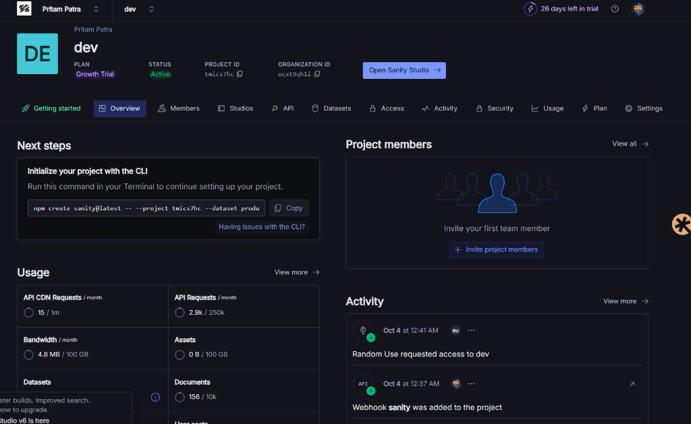

<div align="center">
  
  
  <br />
  <br />

  <p>
    <b>An AI-assisted fact drift detection engine built on Sanity Content Lake.</b>
  </p>
  
  <p>
    <a href="https://fact-ledger.onrender.com">Live Demo</a> •
    <a href="https://pritam.sanity.studio">Sanity Studio</a> •
    <a href="#setup">Installation</a>
  </p>

</div>

---

## 🛑 The Problem: Fact Drift
A product manager at a SaaS company decides to extend refunds from 30 days to 60 days. She opens the CMS, updates the Refund Policy page, and clicks publish. What she doesn't know: the Help Center article still says 30. The Pricing FAQ still says 30. The Onboarding Guide, the Terms of Service, the Enterprise SLA page, the Checkout confirmation modal copy — **all still say 30.**

**That is Fact Drift.** The number "30" is stored in twenty-three places as dead characters. There's no relationship between them. When one changes, the others don't know.

## 💡 The Solution: Fact Ledger
Fact Ledger fixes this at the data model level. Business values become **first-class Sanity documents** (`facts`). Pages don't copy those values; they reference them.

For every page that still has hardcoded plain text, a deterministic scanner runs, finds the stale copies, and raises structured findings. An AI agent drafts exact Sanity patch mutations to fix them. A human reviews the diffs and clicks one button. Everything updates atomically in a single transaction.

> **Rules flag. AI drafts. Human approves. Sanity remembers.**

---

## 🏗️ Architecture & Monorepo

```
fact-ledger/
├── studio/     # Sanity Studio v3 — source of truth, schema, custom actions
├── web/        # Next.js 16 App Router — Live Drift Dashboard & API routes
├── scanner/    # Pure TypeScript deterministic rules (R1–R5) + Vitest tests
├── seed/       # Idempotent seed script (facts, pages, ground truth)
├── bench/      # Benchmark runner — 100% precision/recall validator
└── docs/       # Architecture spec, images, design notes
```

## 🚀 Key Features

* **Deterministic Scanner (0% AI):** 5 strict rules (R1-R5) that catch unlinked matches, contradictions, deprecated references, orphan facts, and temporal violations with 100% precision.
* **AI Remediation Engine:** Automatically drafts exact before/after JSON patches for every stale clause. No unsupervised publishing.
* **Atomic Transactions:** Human editors review AI-drafted fixes in Sanity Studio. One click commits all patches atomically across the entire dataset.
* **App SDK Dashboard:** A real-time Next.js control center monitoring Drift Score, KPIs, and Employee Voice complaints.

---

## 🛠️ Quick Start

### 1. Clone & Install
```bash
git clone https://github.com/Pritam-mb/sanity.git
cd sanity/fact-ledger

# Install all workspace dependencies
npm install --workspace=web
npm install --workspace=studio
npm install --workspace=scanner
npm install --workspace=seed
npm install --workspace=bench
```

### 2. Environment Setup
```bash
cp web/.env.example web/.env.local
```
Fill in `web/.env.local` and `studio/.env`:
* `NEXT_PUBLIC_SANITY_PROJECT_ID`: Your Sanity Project ID
* `NEXT_PUBLIC_SANITY_DATASET`: `fact-ledger`
* `SANITY_API_TOKEN`: Editor token (required for writing findings/patches)

### 3. Seed & Run
```bash
# Seed the demo dataset and run the benchmark validation
npm run demo:reset

# Start the dashboard (localhost:3000)
npm run dev:web

# Start Sanity Studio (localhost:3333)
npm run dev:studio
```

---

## 🧪 Commands

| Command | Action |
| :--- | :--- |
| `npm run dev:web` | Start the Next.js control center |
| `npm run dev:studio` | Start the Sanity Studio |
| `npm run test` | Run Vitest unit tests for the scanner rules |
| `npm run seed` | Inject the test dataset into your Sanity project |
| `npm run bench` | Run the validation benchmark against the ground truth |
| `npm run typegen` | Generate TypeScript types from your GROQ queries |

<br />
<div align="center">
  <i>Built for the <a href="https://dev.to/challenges/sanity-2026-09-16">Sanity + Dev.to AI Challenge</a></i>
</div>
