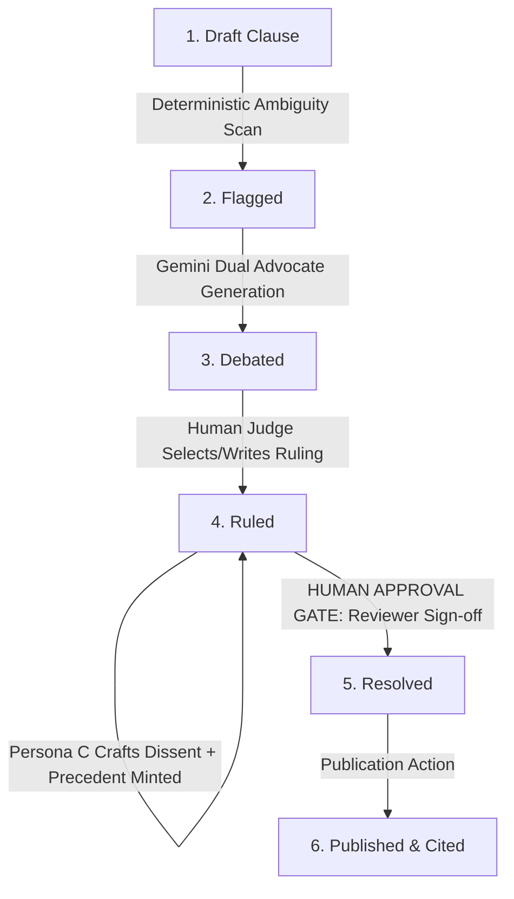

# Clause Court — The Debate Chamber
### *Comprehensive Codebase Context, Architectural Blueprint & Project Narrative*

---

> **“AI argues and assists. Rules flag and tally. A human or council decides. Sanity remembers every voice.”**  
> — *The Clause Court Core Philosophy*

---

## 1. The Origin Story & Problem Statement

### The Illusion of Clarity in Corporate Policy
Every contract, service-level agreement (SLA), privacy policy, and internal governance document is written under the comforting illusion that words mean what their author intended them to mean. Phrases such as:
- *“Refunds will be processed within a reasonable time.”*
- *“Security vulnerabilities must be reported promptly.”*
- *“Data will be retained as necessary for business purposes.”*
- *“Support is provided at the company’s discretion.”*

These phrases survive review because they feel intuitive to the author. But in practice, vague quantifiers, missing definitions, and discretionary conditions are ticking time-bombs. When an outage occurs, a vendor breaches security, or a customer demands compensation, both sides discover that the same sentence yields two entirely conflicting, yet defensible, interpretations. 

### Why Current Solutions Fail
1. **The Static CMS Silo:** Traditional CMS platforms store clauses as inert strings or rich text blocks. They treat content as publishing artifacts rather than operational rules. They record *what* text was published, but lose all institutional memory of *why* it was phrased that way, *what* edge cases were anticipated, and *how* previous disputes over similar phrasing were resolved.
2. **The "Chatbot in the Loop" Trap:** Dumping a policy into a generic LLM produces convincing hallucinations. Models suffer from sycophancy (agreeing with whatever stance the user prompts), inconsistent standards, and ephemeral outputs that vanish when the chat tab closes. AI has no legal standing or institutional accountability; an automated system cannot legitimately declare: *“This is our company’s binding policy.”*

### The Genesis of Clause Court
Built for **Sanity Challenge 2026 (Path Two: Vibe-Code Something Strange)**, **Clause Court (The Debate Chamber)** was created to answer a fundamental question:  
*What if policies were stress-tested before they became disputes, and every resolution created persistent, reusable institutional memory?*

Clause Court is an AI-powered adversarial courtroom and multi-stakeholder governance council for structured policies. It treats policies not as static documents, but as an **evolving legal knowledge graph**:
$$\mathbf{Clause} \longrightarrow \mathbf{Ambiguity\ Flag} \longrightarrow \mathbf{Adversarial\ Debate} \longrightarrow \mathbf{Human\ Ruling} \longrightarrow \mathbf{Reusable\ Precedent} \longrightarrow \mathbf{Future\ Clause}$$

---

## 2. The Core Philosophy: Strict Separation of Responsibilities

The foundational design principle of Clause Court is the strict architectural boundary between deterministic logic, generative AI, human authority, and structured persistence:

```
┌────────────────────────────────────────────────────────────────────────┐
│                        SEPARATION OF RESPONSIBILITIES                  │
├──────────────────┬──────────────────┬──────────────────┬───────────────┤
│  DETERMINISTIC   │    GENERATIVE    │  HUMAN / COUNCIL │    SANITY     │
│      ENGINE      │   GEMINI 2.5     │    AUTHORITY     │  PERSISTENCE  │
├──────────────────┼──────────────────┼──────────────────┼───────────────┤
│ • Scans for      │ • Generates dual │ • Selects or     │ • Graph of 17 │
│   Rule A-E flags │   adversarial    │   writes rulings │   schemas     │
│ • Enforces state │   arguments      │ • Casts binding  │ • Immutable   │
│   machine rules  │ • Drafts Persona │   council votes  │   audit logs  │
│ • Mathematical   │   C dissent      │ • Exercises      │ • Live App    │
│   consensus &    │ • Synthesizes    │   mandatory      │   SDK Studio  │
│   clustering     │   compromise     │   approval gate  │   panel       │
│ • Quorum checks  │   options        │ • Signs off on   │ • Reusable    │
│   & expert veto  │ • NEVER decides  │   releases       │   precedents  │
└──────────────────┴──────────────────┴──────────────────┴───────────────┘
```

1. **Deterministic Code (Zero LLM Hand-Waving):**
   - Ambiguity detection is never left to "AI intuition." It is driven by explicit, inspectable algorithmic rules (unquantified adjectives, missing domain definitions, discretionary conditional phrases, dynamic company standards).
   - Voting tallies, quorum verification, position clustering, and approval gates are pure mathematics and logic.
2. **Generative AI (Gemini 2.5 Flash):**
   - AI acts strictly as an advocate and synthesizer. It explores the extreme interpretations of a clause (Advocate A: customer-friendly vs. Advocate B: operations-focused).
   - Once a human judge rules, AI generates a respectful, legalistic dissent for the losing side.
   - In council sessions, AI clusters human positions into compromise options.
   - **Crucial Rule:** The AI never issues an authoritative ruling, never casts a vote, and never transitions a clause to `resolved`.
3. **Human / Council Authority (The Irreplaceable Gate):**
   - A human judge must evaluate the arguments, inspect prior precedents, and issue the authoritative holding.
   - In the Policy Council, designated human department heads (Legal, Security, Operations, Finance, Vendor Management) deliberate and vote.
   - The transition from `ruled` $\rightarrow$ `resolved` is an enforced **Human Approval Gate** requiring explicit identity and written rationale.
4. **Sanity CMS (The Living Institutional Memory):**
   - Sanity is not just a database; it is the semantic graph engine. Using first-class documents, bi-directional references, custom desk structures, and App SDK governance tools, Sanity preserves every interpretation, dissent, vote, and citation forever.

---

## 3. The Two Operational Tracks

Clause Court operates across two distinct judicial workflows:

### Track 1: The Judicial Chamber (Single Judge & Adversarial AI)
Ideal for standard contract terms, terms of service, and bilateral policies.



1. **Clause Ingestion & Scan:** A clause is drafted in Sanity or submitted via the app (`/clauses`). The deterministic ambiguity engine inspects the text against Rules A, B, D, and dynamic Rule E standards. If signals are found, the clause is automatically moved to `flagged`.
2. **The Debate Chamber (`/debate/[id]`):**
   - The reviewer enters the chamber. Gemini 2.5 Flash streams two opposing briefs in real-time using Server-Sent Events (SSE):
     - **Advocate A (Customer-Friendly / Expansive):** Argues for maximum user flexibility, strict liability on the company, and generous time windows.
     - **Advocate B (Operations-Focused / Restrictive):** Argues for operational feasibility, strict technical constraints, and cost protection.
   - The Quality Gate monitors the output: any hallucinated quotes not in the clause or non-existent precedents are stripped; if arguments overlap by $> 75\%$, they are regenerated.
3. **The Judicial Ruling:**
   - The human judge reviews the opposing arguments, inspects cited precedent, and can either:
     - Adopt Advocate A's interpretation,
     - Adopt Advocate B's interpretation, or
     - Write a bespoke custom ruling.
4. **Dissent & Precedent Generation:**
   - The moment the judge rules, Gemini assumes **Persona C (The Dissenting Voice)** to generate a principled, respectful minority opinion recording why the losing argument had merit.
   - A new **Precedent** document is minted in Sanity, linking the holding, applicable terms, reasoning, dissent, and source clause.
5. **The Human Approval Gate (`ruled` $\rightarrow$ `resolved`):**
   - Even after a judge rules, the clause is not resolved. A human reviewer must explicitly accept the resolution, providing their name and a operational sign-off rationale. The system strictly prohibits automated scripts or LLMs from crossing this gate.

---

### Track 2: The Policy Council Chamber (Multi-Stakeholder Governance)
Designed for enterprise-wide, high-stakes policies (e.g., AI Data Retention, Breach Notification Windows, Vendor Liability Caps) that affect multiple conflicting departments.

```mermaid
flowchart LR
    Briefing[1. Briefing] -->|Chair Opens| Blind[2. Blind Deliberation]
    Blind -->|All Seats Submitted| Open[3. Open Floor Debate]
    Open -->|Chair Synthesizes| Synthesis[4. Synthesis & Options]
    Synthesis -->|Voting Opened| Voting[5. Formal Vote]
    Voting -->|Quorum & Threshold Met| Decision[6. Ruled Decision]
    Decision -->|Two-Person Approval Rule| Released[7. Released Policy]
```



1. **Multi-Department Representation:** 5 dedicated council seats:
   - **Legal (The Skeptic):** Focused on statutory floor compliance (GDPR, CCPA), liability, and defensibility.
   - **Security (The Hardliner):** Focused on threat surface, zero trust, and exposure windows.
   - **Operations (The Pragmatist):** Focused on staffing capacity, SLAs, and execution overhead.
   - **Vendor Management (The Negotiator):** Focused on supply chain partner feasibility.
   - **Finance (The Risk Taker):** Focused on bottom-line impact, margins, and insurance coverage.
2. **Two-Stage Deliberation (Preventing Anchoring Bias):**
   - **Round 1 (Blind Positions):** Members submit structured positions (`proposedValue`, `unit`, `rationale`, `confidence` 1–5) without seeing other members' submissions. This prevents junior or risk-averse departments from anchoring to Legal or the Chair.
   - **Round 2 (Open Floor):** Once all members submit, the chamber reveals the spectrum plot. Members can inspect peer rationales, cross-examine with threaded comments, and submit revised positions.
3. **Deterministic Math & Clustering:**
   - The engine computes the range, median, and single-linkage clusters (grouping positions within 40% of the range).
   - Computes a mathematical **Consensus Score**:
     $$\text{Consensus} = \frac{1}{1 + \frac{\text{spread}}{\text{scale}}}$$
4. **AI-Assisted Compromise Options:**
   - Gemini examines the clusters and draft proposals for formal voting (e.g., Option 1: "Fast-Track 24h", Option 2: "Risk-Tiered 48h/72h", Option 3: "Statutory 72h Default").
5. **Voting, Quorum & Expert Veto Protection:**
   - Members cast formal votes.
   - **AssertVote:** Enforces one vote per member per session.
   - **CheckQuorum:** Requires $\ge 60\%$ total member participation.
   - **CheckRequiredSeats (The Veto Rule):** For security and legal policies, designated expert seats (Legal & Security) *must* participate. A convenient majority of Finance and Operations cannot bypass the experts.
6. **The Two-Person Approval Sign-off:**
   - A passed council decision requires explicit sign-off from two distinct approvers.
   - **Integrity Rule:** Neither the clause author nor the council chair may serve as an approver.

---

## 4. The Killer Demo: The Living Reference Graph

The central differentiator of Clause Court is that rulings do not end up in an archived PDF graveyard. Every ruling feeds directly into a living reference graph visualized via ReactFlow at `/graph`:

```
┌─────────────────┐       ┌─────────────────┐       ┌─────────────────┐       ┌─────────────────┐
│     CLAUSE      │       │     RULING      │       │    PRECEDENT    │       │  FUTURE CLAUSE  │
│      #0042      │ ───▶  │   Judge Priya   │ ───▶  │ "Reasonable Time│ ───▶  │      #0043      │
│  Refund Policy  │       │      Raman      │       │ in Refund Policy│       │ Enterprise SLA  │
└─────────────────┘       └─────────────────┘       └─────────────────┘       └─────────────────┘
                                                             │ cites ★
                                                             ▼
                                                    [Future Debates feed
                                                    precedent back into
                                                    AI advocate prompts]
```

### The Institutional Accumulation Story
1. **Clause #0042 (Refund Policy):** Contains the phrase *"Refunds will be processed within a reasonable time."*
2. **The Debate:** Advocate A argues for 5 calendar days. Advocate B argues for 45 business days.
3. **The Ruling:** Judge Priya Raman issues a ruling establishing **30 calendar days** as the institutional definition of "reasonable time" for financial reversals.
4. **The Precedent:** A Precedent document is created, indexed under the applicable term `"reasonable"`.
5. **The Proof of Accumulation (Clause #0043):** Months later, a new clause regarding *Enterprise SLA Termination* is introduced with vague cure windows. The engine runs its relevance algorithm, discovers Judge Raman's precedent, and injects it directly into Advocate A and B's debate prompts:
   > *“Prior institutional precedent in Case #0042 held that reasonable notice is 30 calendar days. Advocate A must argue why this applies here; Advocate B must argue why SLA termination warrants a different standard.”*

The graph proves that the system accumulates wisdom over time rather than resetting per debate.

---

## 5. The Under-the-Hood Engines

### 5.1. Deterministic Ambiguity Engine (`src/lib/ambiguity/detector.ts`)
Zero LLM calls. Runs deterministically in sub-millisecond time:
- **Rule A (Vague Quantifiers):** Scans for 19 inspectable subjective terms (`reasonable`, `promptly`, `timely`, `substantial`, `adequate`, `periodic`, `appropriate`, `satisfactory`, `significant`, `customary`, `undue delay`, `best efforts`, `commercially reasonable`, `material`, `negligible`, `fair`, `good faith`, `as needed`, `from time to time`).
- **Rule B (Missing Definition):** Identifies capitalized domain terms (e.g., `Priority Customer`, `Enterprise Tier`, `Active Session`) that lack a corresponding Sanity `definition` document linked to the clause.
- **Rule D (Conditional Ambiguity):** Flags discretionary escape hatches (`when appropriate`, `as necessary`, `to the extent possible`, `at the company's discretion`, `subject to availability`).
- **Rule E (Company Standards):** Dynamically queries Sanity `companyStandard` documents for custom banned phrases (e.g., internal directives banning `"best efforts"` in favor of `"commercially reasonable efforts"`).

### 5.2. Debate Quality Gate (`src/lib/debate/quality.ts`)
Prevents AI hallucinations and enforces substantive debate:
- **Textual Evidence Verification:** Inspects every quote cited by the advocates; if a quote does not appear verbatim in the clause text, it is immediately stripped.
- **Precedent Verification:** Cross-references cited precedent titles against the actual Sanity precedent library passed into the prompt. Halts hallucinated legal citations.
- **Jaccard Distance Adversarial Validation:** Calculates the word-level Jaccard similarity between Advocate A and Advocate B's arguments:
  $$J(A, B) = \frac{|A \cap B|}{|A \cup B|}$$
  If overlap exceeds $75\%$, the debate is rejected and regenerated to guarantee true adversarial disagreement.

### 5.3. Precedent Relevance Algorithm (`src/lib/precedent/relevance.ts`)
- Explicit citations by ID receive **100 points**.
- Keyword matches against `applicableTerms` receive **75 base points + 10 points per additional term match + 10 points for holding keyword matches**.
- Scores are categorized: High ($\ge 70$), Medium ($40 - 69$), Low ($< 40$).
- Only Medium and High relevance precedents are fed into AI advocate prompts.

### 5.4. Council Decision & Clustering Math (`src/lib/council/tally.ts`)
- **Single-Linkage Clustering:** Groups member proposals whose values fall within $40\%$ of the total spread.
- **Confidence-Weighted Consensus:** Weighs individual positions by their self-reported confidence score (1–5).
- **Two-Person Rule Validator:** Programmatically enforces that approval records contain at least two unique IDs, and rejects any approval signed by the author or the chair.

---

## 6. Sanity Content Architecture (17 Schema Types)

The data model in [`src/sanity/schemaTypes`](file:///d:/work/sanity/clause-court/src/sanity/schemaTypes) represents a complete institutional legal knowledge graph:

| Schema | Role & Purpose | Key Fields |
|---|---|---|
| **`clause`** | Core policy document subject to review | `title`, `text`, `category`, `caseNumber`, `status`, `ambiguitySignals`, `transitionLog[]`, `definitions[]`, `citedPrecedent[]` |
| **`interpretation`** | An advocate's defensible reading | `clause`, `side` (A/B), `title`, `summary`, `argument`, `textualEvidence[]`, `citedPrecedent[]` |
| **`debate`** | An adversarial clash session | `clause`, `interpretationA`, `interpretationB`, `status`, `startedAt`, `completedAt` |
| **`ruling`** | Authoritative human decision | `clause`, `debate`, `session`, `chosenInterpretation`, `customRuling`, `reasoning`, `dissent`, `judgeName` |
| **`precedent`** | Minted institutional precedent | `title`, `holding`, `reasoning`, `applicableTerms[]`, `citationCount`, `ruling`, `sourceClause`, `citesPrecedent[]` |
| **`council`** | Governance council charter | `name`, `seats[]`, `quorumPct`, `thresholdPct`, `requiredSeats[]`, `chair` |
| **`councilMember`** | Designated stakeholder identity | `name`, `seat` (Legal, Security, Ops, etc.), `active`, `bio` |
| **`session`** | Deliberation chamber instance | `clause`, `council`, `status`, `round` (blind/open), `deadline` |
| **`position`** | A member's quantitative proposal | `session`, `member`, `stance`, `proposedValue`, `unit`, `rationale`, `confidence`, `round`, `revisionOf` |
| **`councilOption`** | Formatted voting alternative | `session`, `title`, `summary`, `proposedValue`, `unit`, `sourceCluster` |
| **`vote`** | A member's binding ballot | `session`, `member`, `option` |
| **`approval`** | Two-person sign-off record | `session`, `approver`, `note`, `timestamp` |
| **`comment`** | Deliberation thread argument | `session`, `member`, `text`, `stance` (support, challenge, question) |
| **`definition`** | Canonical domain dictionary term | `term`, `definition`, `source` |
| **`regulation`** | Statutory benchmark floor | `title`, `reference`, `kind`, `floorValue`, `floorUnit` |
| **`companyStandard`**| Internal policy directives & bans | `title`, `bannedPhrases[]` |

---

## 7. Sanity Studio App SDK & Workflow Integration

Clause Court deeply integrates with Sanity Studio (available at `/studio`):

### 1. App SDK Workflow & Governance Panel (`src/sanity/components/ClauseWorkflowPanel.tsx`)
Rendered directly inside Sanity Studio alongside clause documents:
- **Interactive State Machine Stepper:** Displays real-time progress across all 6 lifecycle stages (`Draft` $\rightarrow$ `Flagged` $\rightarrow$ `Debated` $\rightarrow$ `Ruled` $\rightarrow$ `Resolved` $\rightarrow$ `Published`).
- **Human Authority Callout:** Outlines the strict legal rules governing state transitions.
- **Immutable Transition Audit Trail:** Displays the complete historical log (`transitionLog[]`) showing timestamps, prior state, new state, actor name, actor type (`[Engine]`, `[Human]`, `[AI]`), and operational rationales.

### 2. Live Interactive App Preview (`src/sanity/components/ClauseCourtPreview.tsx`)
An embedded, responsive preview pane inside Studio that runs the live Next.js application inside an iframe, allowing reviewers to jump directly from Sanity content editing into the active debate or deliberation chamber.

### 3. Workflow Action Overrides (`src/sanity/ClauseWorkflowActions.tsx`)
Replaces default Studio publish buttons with transition actions derived from the shared state machine:
- `Mark Flagged` (Engine)
- `Record Debate` (Engine)
- `Issue Ruling` (Human)
- `Approve Resolution` (Human Approval Gate)
- `Publish Clause` (Human)

### 4. Custom Desk Structure (`src/sanity/structure.ts`)
Organizes content by actionability:
- **Needs Review Queue:** Filtered list of clauses currently in `flagged`, `debated`, or `ruled` states requiring human intervention.
- **Status Folders:** Direct access to clauses at any specific workflow step.
- **Clean Typographic Organization:** Zero emoji clutter; professional corporate desk presentation.

---

## 8. The Visual Overhaul: Typographic Modernization

In the final evolution of the application, Clause Court underwent a complete **visual overhaul** to eliminate all static emojis, emoji logos, and pseudo-symbols across both the Next.js app and Sanity Studio:

```
BEFORE:  ⚖ CLAUSE COURT   [⚡ Debates]  [📋 Clauses]  [🕸 Graph]   [🪪 Identity]
AFTER:   CLAUSE COURT      Debates       Clauses       Graph        IDENTITY: View as...
```

### Design Standards:
- **Pure Typographic Branding:** The header features the regal serif title `CLAUSE COURT` in Cormorant Garamond with subtle gold illumination.
- **Zero Icons in Navigation & Options:** Navigation links and dropdown menus are purely typographic, eliminating distracting icon clutter.
- **Monospace Medallion Badges:** In the interactive precedent graph ([`PrecedentGraph.tsx`](file:///d:/work/sanity/clause-court/src/app/graph/PrecedentGraph.tsx)), emoji node icons were replaced with clean, circular monospace letter medallions:
  - **`C`** — Clause Nodes
  - **`R`** — Ruling Nodes
  - **`P`** — Precedent Nodes
- **CSS Status Indicators:** Replaced `🔵` and `🟡` advocate emojis with precise 8px colored CSS dots and clean uppercase text (`Advocate A`, `Advocate B`).
- **Color Palette ("Judicial Noir"):**
  - Background Base: `#080a0f`
  - Panel / Card Surface: `#131720` / `#181c27`
  - Accent Gold: `#c9a84c`
  - Advocate A Sapphire: `#3b82f6`
  - Advocate B Amber: `#f59e0b`
  - Success Mint: `#10b981`
  - Danger Rose: `#ef4444`

---

## 9. Full Application Directory & API Map

### Frontend Routes (`src/app`)
- **`/` (Dashboard):** High-level KPI metrics, personal "Your Move" action queue, recent institutional rulings, and one-click demo data reset.
- **`/clauses`:** Filterable directory of clauses (All, Needs Review, Flagged, Debated, Ruled, Resolved) with modal case submission (`SubmitCaseForm`).
- **`/clauses/[id]`:** Detailed clause brief, detected ambiguity signals, cited precedents, lifecycle stepper, human approval gate action bar, and audit trail timeline.
- **`/debate/[id]`:** Real-time dual-advocate debate chamber with SSE streaming transcripts, precedent citation badges, and judicial ruling console.
- **`/chamber/[id]`:** Multi-stakeholder deliberation chamber with position spectrum plot, cluster analysis, threaded debate comments, voting booth, and two-person approval sign-off.
- **`/council`:** Governance council charter, quorum and threshold rules, required seat policies, and active member directory.
- **`/knowledge`:** Statutory regulations, benchmark floors, domain definitions, and internal company standards (Rule E).
- **`/graph`:** Interactive 4-column ReactFlow precedent graph showing reference linkages from clauses to rulings, precedents, and citing clauses.
- **`/precedents` & `/precedents/[id]`:** Institutional precedent library detailing case holdings, judicial reasoning, dissenting opinions, and downstream citation counts.

### Backend API Endpoints (`src/app/api`)
- **`POST /api/clauses`:** Creates a new clause with automatic sub-millisecond ambiguity pre-scan.
- **`POST /api/debate` & `GET /api/debate/stream/[id]`:** Generates and streams dual-advocate adversarial arguments via Server-Sent Events.
- **`POST /api/ruling`:** Submits human judicial ruling, triggers Gemini Persona C dissent generation, mints new precedent, and logs transition.
- **`GET/POST /api/workflow`:** Queries and validates clause state machine transitions.
- **`POST /api/seed`:** Rebuilds the canonical 12-clause, 4-definition demonstration dataset with intact citation chains.
- **`GET /api/members`:** Retrieves council member directory for the global identity switcher.
- **`GET/POST /api/sessions` & `GET /api/sessions/[id]`:** Manages council deliberation sessions with privacy-filtered position rounds.
- **`POST /api/sessions/[id]/positions`:** Submits blind or open quantitative positions.
- **`POST /api/sessions/[id]/comments`:** Posts threaded cross-examination commentary.
- **`POST /api/sessions/[id]/options`:** Creates synthesized compromise voting options.
- **`POST /api/sessions/[id]/votes`:** Casts ballots, verifies one-vote rules, and checks quorum.
- **`POST /api/sessions/[id]/approvals`:** Validates and records two-person approval sign-offs.
- **`POST /api/sessions/[id]/advance`:** Orchestrates session stage transitions (Reveal, Synthesis, Voting, Ruling, Release).

---

## 10. Automated Testing & Verification

The repository maintains an automated test suite executed via the native Node.js test runner (`npm test`), guaranteeing mathematical integrity and architectural compliance:

| Test Suite | File | Tests | Validated Behaviors |
|---|---|:---:|---|
| **Ambiguity Engine** | `tests/ambiguity.test.ts` | 5 | Detects Rule A vague quantifiers (`reasonable`, `promptly`); detects Rule D conditional ambiguity (`when appropriate`); suppresses Rule B when definition exists; verifies zero false positives on clean clauses. |
| **Quality Gate** | `tests/quality.test.ts` | 4 | Strips hallucinated quotes; filters non-supplied precedents; rejects debates where advocates have $> 75\%$ Jaccard argument overlap. |
| **Seed Integrity** | `tests/seed-integrity.test.ts` | 5 | Validates 12 clauses and 4 definitions; ensures 2–3 flagged clauses; verifies all definition references resolve; confirms complete reference chain (#0042 $\rightarrow$ ruling $\rightarrow$ precedent $\rightarrow$ #0043); ensures zero dangling pointers. |
| **Workflow State** | `tests/workflow.test.ts` | 7 | Validates 6-step lifecycle sequence; confirms state indices; strictly enforces Human Approval Gate (`ruled` $\rightarrow$ `resolved` requires human actor); blocks automated pipelines from bypassing gate. |
| **Total** | | **21 / 21 Passing** | **Zero failures. Zero TypeScript compiler errors (`tsc --noEmit`).** |

---

## 11. The Story Draft: How to Tell the Story of Clause Court

If you are writing a hackathon submission post, a technical article, or presenting a live demo, this is the suggested narrative arc:

### Act I: The Hidden Cost of "Reasonable"
*Start with the pain point.* Every business runs on contracts and policies that people assume are clear until money or security is on the line. Show how a single phrase—*"Refunds will be processed within a reasonable time"*—costs enterprises millions in legal arguments, customer churn, and engineering thrash. Explain how traditional CMS tools treat policies like dead text, and how generic AI chat tabs hallucinate unbacked answers that vanish when the tab closes.

### Act II: The Courtroom in the Machine
*Introduce the metaphor.* What if we didn't wait for a lawsuit? What if we built a digital courtroom inside our content platform? Introduce **Clause Court**. Show how deterministic rules immediately catch the ambiguity signal without any AI guesswork. Then, open the doors of the **Debate Chamber**: two AI advocates powered by Gemini 2.5 Flash arguing opposite sides in real time. Advocate A fights for the customer; Advocate B fights for the bottom line. It's adversarial, electric, and substantive.

### Act III: The Human Judge & The Living Precedent
*Show the human-in-the-loop breakthrough.* The AI does not decide. A human reviewer sits on the bench. The judge weighs the briefs, reads previous holdings, and issues the binding ruling: 30 calendar days. Immediately, the AI crafts a respectful dissent for the losing side, and Sanity mints an immutable **Precedent** document. Then, demonstrate the **Human Approval Gate**: the clause cannot resolve itself—a human must sign off.

### Act IV: The Accumulation (The Killer Moment)
*Deliver the punchline.* Open a second clause written months later. It has vague cure language. But this time, the AI advocates don't start from scratch—they cite Judge Raman's 30-day precedent from Case #0042! Open the interactive **Graph View**: watch the glowing reference chain link Clause to Ruling to Precedent to Future Clause.

### Act V: The Policy Council (Enterprise Democracy)
*Scale the vision.* For decisions too big for one judge, enter the **Policy Council Chamber**. Show how 5 distinct departments (Legal, Security, Ops, Finance, Vendors) deliberate with blind positions to eliminate bias, how deterministic math clusters their proposals, how AI crafts compromise options, and how expert veto rules prevent convenient majorities from cutting security corners.

### Conclusion: Institutional Wisdom as Code
Clause Court transforms static corporate policies into a self-strengthening, human-governed institutional brain. It demonstrates that the future of AI isn't replacing human judgment—it's sharpening it, stress-testing it, and using Sanity to remember it forever.
