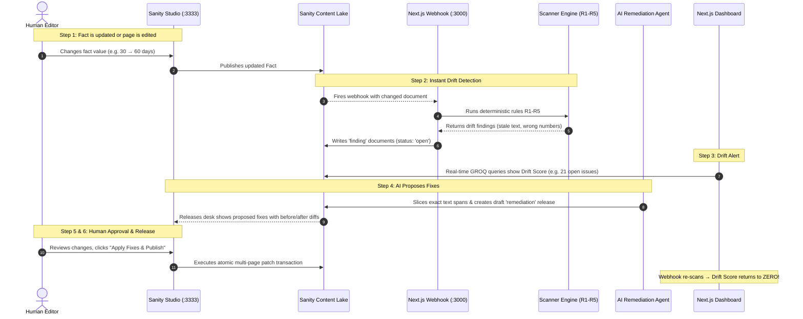

# Fact Ledger: Quick Project Overview & Process Flow

> **Core Principle:** *Rules flag. AI drafts. Human approves. Sanity remembers.*  
> **Headline Promise:** *Change one fact, find every stale copy, fix them in one reviewed release, and verify drift is zero.*

---

## 1. What is the Agenda of this Project? (The Problem & The Solution)

### The Real-World Pain Point: "Fact Drift"
Every company repeats the same critical numbers across dozens of pages:
- **Refund Policy:** *"30 days"*
- **SLA Uptime:** *"99.9%"*
- **File Upload Limits:** *"100 MB"*
- **Support Response Times:** *"4 hours"*
- **Trial Length:** *"14 days"*

**What happens in normal companies:**
1. Leadership decides: *"We are extending refunds from 30 days to 60 days."*
2. An editor updates the main **Refund Policy** page in the CMS.
3. **The disaster:** The Help Center, Terms of Service, Pricing FAQ, Onboarding Emails, and Enterprise SLA pages are forgotten. They continue to say *"30 days"*.
4. Customers get angry, legal liability increases, and team members give conflicting answers.

This is **Fact Drift**.

---

### The Fact Ledger Solution
Instead of treating text as dead strings, Fact Ledger makes facts **living documents** in Sanity:
1. **Facts as Entities:** A fact like `Refund Window: 30 days` is its own document.
2. **Dynamic References:** Pages reference the fact dynamically via `factRef`.
3. **Automated Drift Hunter:** If someone hardcodes plain text or writes a conflicting number, deterministic scanner rules (R1 to R5) catch it immediately.
4. **AI Auto-Remediation:** An AI agent writes exact JSON patches replacing stale text with dynamic references.
5. **One-Click Human Release:** An editor reviews the proposed diffs in Sanity Studio and clicks **"Apply Fixes & Publish"** to atomically update all pages at once.
6. **Zero Drift:** The system proves drift is back to 0, logged forever in an immutable audit ledger.

---

## 2. End-to-End Process Flow

```
┌────────────────────────────────────────────────────────────────────────────────────────┐
│                                 THE 6-STEP PROCESS FLOW                                │
└────────────────────────────────────────────────────────────────────────────────────────┘

 [1. EDIT FACT] ─────────▶ [2. DETECT DRIFT] ─────────▶ [3. GENERATE FINDINGS]
  Editor updates fact in    Webhook fires scanner       Open findings created in
  Sanity Studio (30d→60d)   running rules R1 to R5      Sanity (showing page, span, offset)
        │
        ▼
 [4. AI DRAFTS FIXES] ───▶ [5. HUMAN APPROVAL] ───────▶ [6. ATOMIC RELEASE & ZERO DRIFT]
  AI Agent slices text      Editor opens Studio release   One-click patches all pages,
  and builds JSON patches   and reviews before/after      resolves findings, logs audit
```

---

### Step-by-Step Breakdown:



---

## 3. How the Pieces Fit Together

| Component | Technology | What it does | Port / Location |
|---|---|---|---|
| **Content Lake** | Sanity.io Cloud | Database storing canonical Facts, Pages, Findings, and Audit Logs | Project `tmics7hc` |
| **Sanity Studio** | Sanity Studio v3 + Vite | Visual CMS editor where humans edit facts and approve remediation releases | [http://localhost:3333](http://localhost:3333) |
| **Scanner Engine** | Pure TypeScript (Zero-AI) | Evaluates 5 algorithmic rules (R1 to R5) in milliseconds with 100% precision/recall | `scanner/src/index.ts` |
| **Web Dashboard** | Next.js 16 (App Router) | Displays real-time KPIs (Drift Score, Coverage %), findings table, and audit trail | [http://localhost:3000](http://localhost:3000) |
| **AI Remediation Agent** | Next.js Route + Sanity Client | Slices text at exact character offsets and drafts JSON patch mutations | `/api/agent/remediate` |
| **Custom Action** | React Document Action | "Apply Fixes & Publish" button in Studio that atomically executes all patches | `studio/actions/...` |
| **Audit Ledger** | Sanity `changeEvent` | Immutable record of who edited what, when fixes were drafted, and who published them | Visible on Dashboard & Studio |

---

## 4. The 5 Scanner Rules Explained in Plain English

| Rule | Name | What it catches | Example |
|---|---|---|---|
| **R1** | **Unlinked Match** | Someone typed the number as plain text instead of using a dynamic `factRef` | Page body contains literal string `"30 days"` |
| **R2** | **Contradiction** | A different number appears near the fact's label | Text says: *"The refund window is now **60** days"* while fact says 30 |
| **R3** | **Deprecated Reference** | A page uses a dynamic reference, but the fact was marked deprecated | Page points to an old retired policy |
| **R4** | **Orphan Fact** | An active business fact exists in Sanity, but no page ever references it | Dead policy parameter |
| **R5** | **Temporal Violation** | A page references a fact that has expired or isn't active yet | Summer promo pricing referenced in November |

---

## 5. Why This Design is Special

1. **No Hallucinations:** Generative AI is NEVER allowed to make arbitrary decisions or publish directly. Algorithmic rules flag drift deterministically, and humans hold the approval key.
2. **Atomic Releases:** Fixes don't get applied piecemeal. All 20+ stale pages are updated simultaneously in one Sanity transaction.
3. **Zero Hardcoded Data:** Every metric on the dashboard (Drift Score, coverage %, audit logs) comes from live GROQ queries against Sanity.
4. **Complete Traceability:** Every drafted fix and human approval is logged as an immutable `changeEvent`.

---

## 6. Quick Verification Commands

```bash
# Start both local servers (Web + Studio)
npm run dev

# Run the automated benchmark against 31 planted drift issues
npm run bench

# Run scanner unit tests (Vitest)
npm run test

# One-command full reset (Seeds facts/pages + runs benchmark)
npm run demo:reset
```
